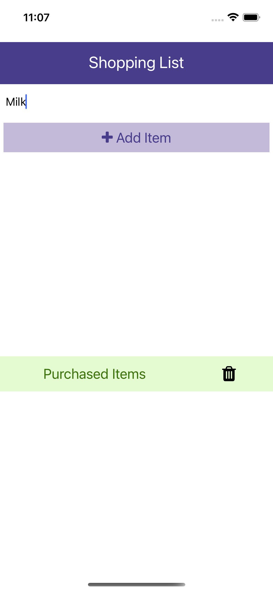
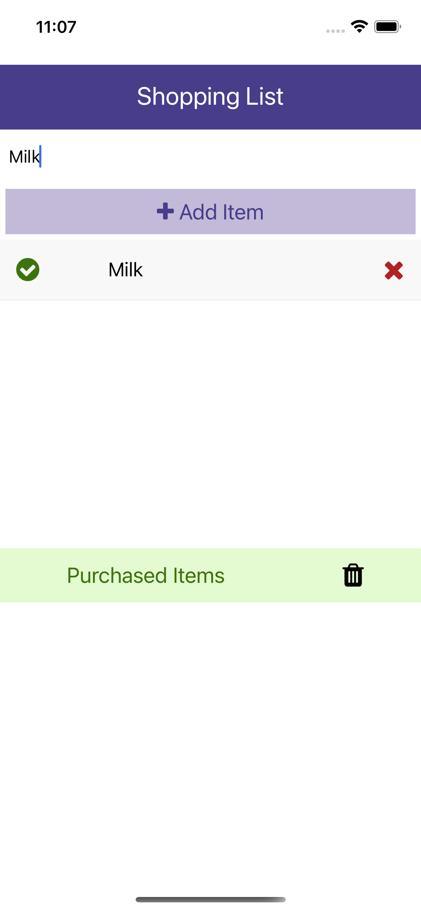
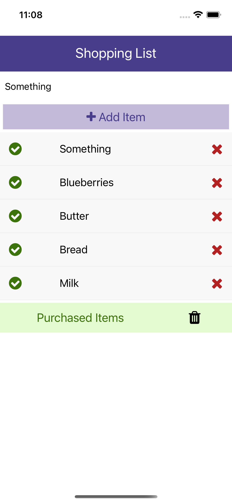
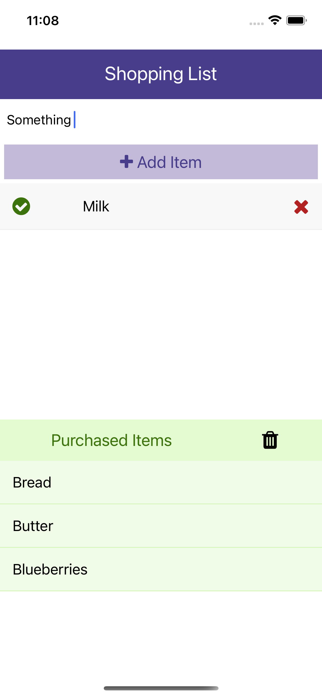
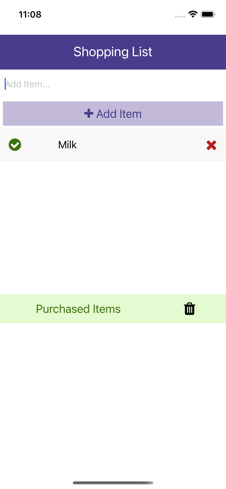
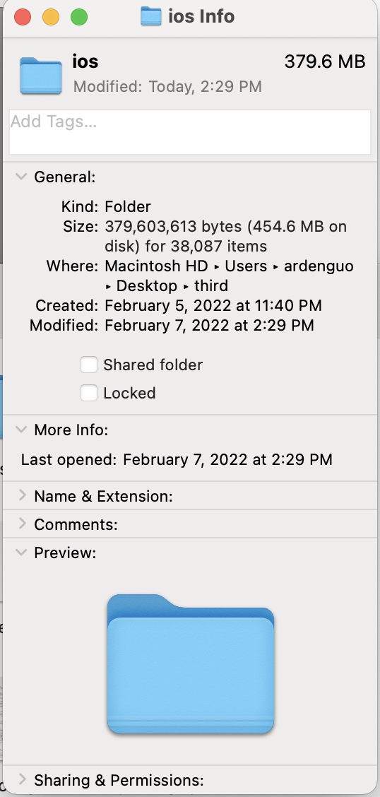

## Application Overview - Arden's Shopping List
### Support Functionality
* Add items to the shopping list
* Delete items from the shopping list
* Mark items in the shopping list as purchased
    * the corresponding item will disappear from the shopping list
    * the corresponding item will appear in the purchased item list
* Empty the purchased item list

### Process
* Step 1. This is the interface of the mini app
<kbd>

</kbd>

* Step 2. Above Add Item button, users can type something in the text box.
<kbd>

</kbd>

* Step 3. After typing, click add item so that the item will be added to the shopping list.
<kbd>

</kbd>

* Step 4. Simply add more items to the shopping list.
<kbd>

</kbd>

* Step 5. For each item in the shopping list, click the delete button will delete the item from the shopping list. Click the check button will mark the item as purchased so that the item will be moved into the purchased item list.
<kbd>

</kbd>

* Step 6. After shopping and before next shopping, users may need to empty the purchased item list so simply click the trash button.
<kbd>

</kbd>

### Remarks
There is a folder called `ios` in my local directory but it cannot be uploaded to gitHub. It may be due to the large size. Here is the info of the folder:
<kbd>

</kbd>